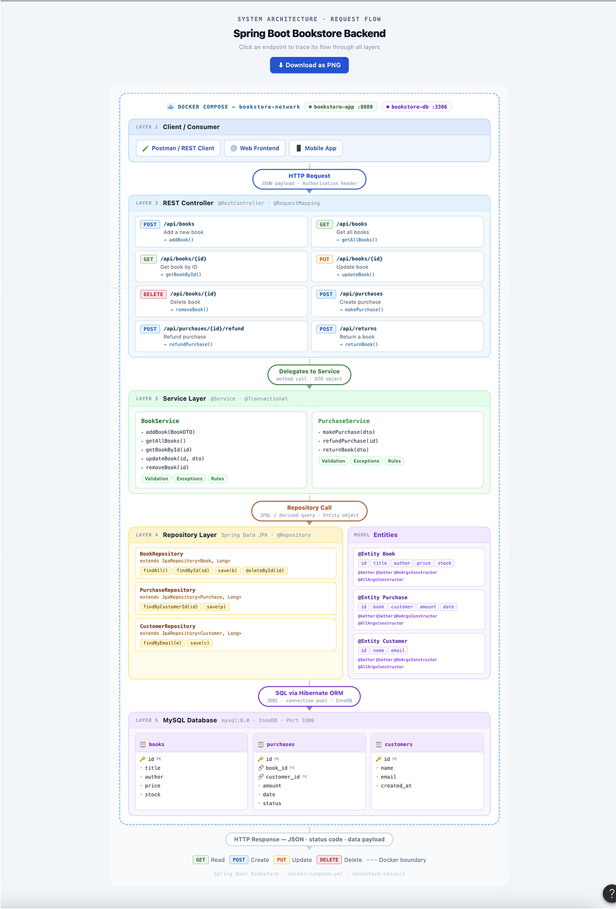

# 📚 Bookstore Backend Service Layer

A high-performance, containerized Spring Boot RESTful API designed to manage an enterprise book catalog, consumer profiles, and transaction lifecycles.

---

## 🏗️ System Architecture & Data Flow

Our system architecture was structurally blueprinted and verified using **Figma** during the initial design phase to enforce clear decoupling boundaries.


### 🎨 High-Fidelity Figma Structural Design



## 🛠️ Prerequisites & Environmental Configurations

*   **Runtime Environment**: Java 21 LTS & Maven 3.9+
*   **Virtualization Tools**: Docker Engine & Docker Compose v2+
*   **Database Infrastructure**: MySQL 8.0 Relational Engine

### Application Environment Variables (`application.yml`)
The framework leverages dynamic environment fallback properties. You can easily configure or override these parameters through your terminal runtime context:

| Configuration Property | Default Fallback Value                     | Purpose Description                                        |
|:-----------------------|:-------------------------------------------|:-----------------------------------------------------------|
| `DB_URL`               | `jdbc:mysql://localhost:3306/bookstore_db` | Relational server connection address string                |
| `DB_USER`              | `root`                                     | Database administrator access profile name                 |
| `DB_PASSWORD`          | `rootpassword`                             | Secured database credential access string                  |
| `MIN_PRICE_LIMIT`      | `0.0`                                      | Custom business logic threshold value for price validation |

---

## 🏃 Local Execution & Deployment Quickstart

### Option A: Local Orchestration Stack (Docker Compose)
To compile the core source package code and spin up the complete multi-service environment (`bookstore-app:8080` and `bookstore-db:3306`) seamlessly inside the container network, run:

```bash
# Compile dependencies and launch the fully isolated architecture stack
docker-compose up --build -d

# Verify that both structural application containers are running and healthy
docker ps
```

### Option B: Bare-Metal Local Development Setup
If you want to run the core backend logic natively on your host machine while linking to an external or containerized database container instance:

1.  Launch only the database daemon container:
    ```bash
    docker-compose up -d mysqldb
    ```
2.  Boot up your Spring Boot runtime service using the Maven wrapper:
    ```bash
    ./mvnw spring-boot:run
    ```

---

## 📖 Interactive OpenAPI / Swagger Reference

Once the backend application finishes initialization, the active endpoint configurations are exposed automatically. You can read API parameters, inspect payloads, and send test requests through your web browser:

👉 **[http://localhost:8080/swagger-ui/index.html](http://localhost:8080/swagger-ui/index.html)**

### Core Monitored Endpoint Routing (For Assignment Assessment)
*   **Add New Book Asset**: `POST /api/books` (Expects structural JSON payload body, returns `201 Created`)
*   **Fetch Single Catalog Record**: `GET /api/books/{id}` (Returns `200 OK` or parses an elegant `404 Not Found`)
