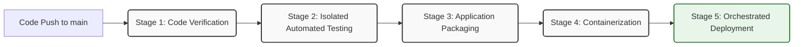

# 🚀 Deployment Blueprint & Automated Pipeline Specification

This document presents the technical proposal for the target deployment architecture and the Continuous Integration / Continuous Delivery (CI/CD) automation pipeline designed for the Bookstore Backend microservice.

---

## 1. Target Deployment Infrastructure Strategy

The proposed production infrastructure isolates runtime environments across a multi-tier cloud topology to ensure scalability, network isolation, and strict access controls.

*   **Application Hosting Layer**: The containerized Spring Boot backend engine runs inside an orchestration tier (such as AWS ECS or a managed Kubernetes cluster). It scales dynamically behind a public-facing Application Load Balancer (ALB).
*   **Persistent Storage Tier**: The MySQL relational database engine operates within a dedicated private subnet, completely isolated from direct public internet routing.
*   **Virtual Container Network**: Traffic between the application engine container and the relational storage nodes routes entirely over an isolated virtual network bridge (`bookstore-network`), matching local Docker settings.

---

## 2. CI/CD Lifecycle Pipeline Stages

The system relies on an automated, linear execution pipeline triggered on every code commit or merged pull request to the primary `main` branch. This process guarantees code quality before any binary compiles or deploys.

### 2.1 Graphical Pipeline Automation Flow


---

## 3. Detailed Stage Breakdown

### 📊 Stage 1: Code Verification & Static Analysis
*   **Execution Trigger**: Automated commit processing hook.
*   **Actions**: The runner pulls the source tree and applies static analysis checks to evaluate formatting rules, style linting constraints, and check for architectural anomalies.
*   **Pass Criteria**: Zero fatal code smells or styling breaches detected.

### 🧪 Stage 2: Isolated Automated Testing
*   **Execution Trigger**: Successful verification pass.
*   **Actions**: Executes the complete Java test suite using `mvn test`. This isolates components using JUnit 5 and explicitly checks core validation boundaries by mocking external database calls with Mockito.
*   **Pass Criteria**: **100% of all written tests must pass successfully**. Any test failure immediately stops the pipeline and blocks delivery.

### 📦 Stage 3: Application Packaging
*   **Execution Trigger**: 100% automated test verification.
*   **Actions**: Compiles the source files into a stable, production-ready runnable output using the Maven wrapper package utility:
    ```bash
    ./mvnw clean package -DskipTests
    ```
*   **Pass Criteria**: Successful assembly of the standalone executable fat JAR file inside the target directory.

### 🐳 Stage 4: Containerization
*   **Execution Trigger**: Successful packaging pass.
*   **Actions**: The pipeline reads the embedded project `Dockerfile`, downloads the secure base runtime layer, injects the packaged JAR artifact, and builds a compact production image.
*   **Pass Criteria**: Image builds cleanly and registers successfully within a secure container registry.

### 🚀 Stage 5: Orchestrated Deployment
*   **Execution Trigger**: Successful registration of the new container image version.
*   **Actions**: Triggers a rolling update on the target orchestration host. The environment pulls down the latest container image tag, boots up the new application layers, confirms their health checks, and safely tears down outdated nodes.
*   **Pass Criteria**: The application system successfully reports a live status code status via the `/actuator/health` boundary.
